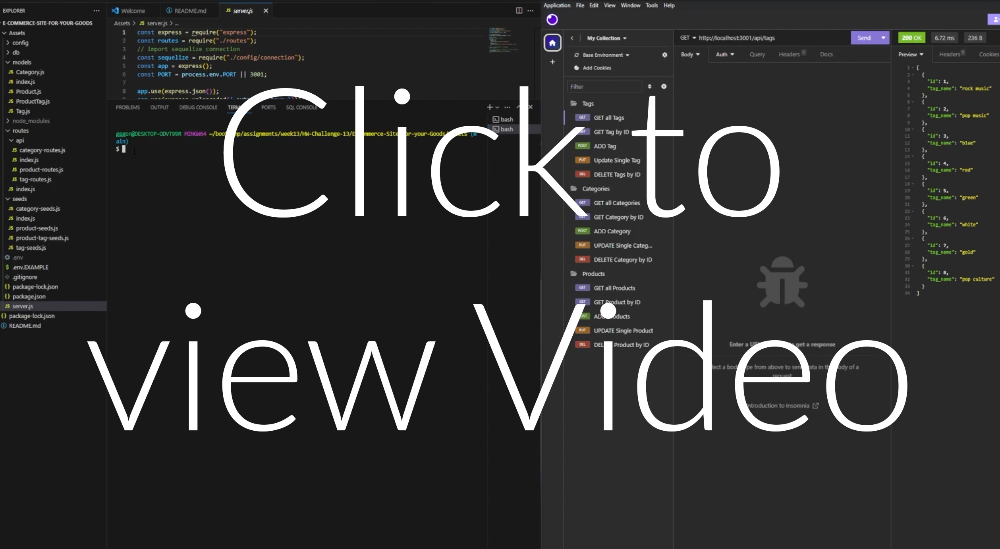

# E-Commerce-Site-for-your-Goods

## User Story

AS A student

I WANT to build a fully functional backend e-commerce website through insomnia

SO THAT anyone with Node can view an array of diffrent data

## Acceptance Criteria

GIVEN a that the server is fully functionable

WHEN I successfully run node and it executes all the routes, seeds and models

WHEN I create a working Sequelize and schema commands

WHEN I create a database that houses all the data

WHEN I have a working API GET, POST, PUT and DELETE routes in insomnia

When YOU can input the URL and press send

When YOU can physically see the code in JSON

When I have created a working organize Tags, Catagories and products in folders

WHEN I created an orginized video on how it all works

## Walkthrough Video

